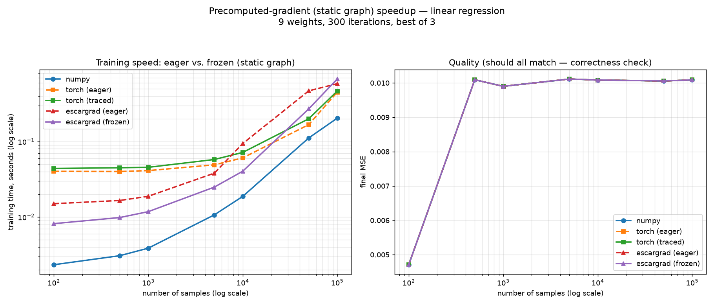

# Regression timing experiment — three ways to get a gradient

This experiment builds **linear regression from scratch three different ways**,
proves they all learn the same thing, then races them — and uses the race to
learn what a **precomputed (static) gradient graph** actually buys you.

---

## What is a regression, simply?

Strip away the jargon and a regression is just this loop:

1. **Take data.** Pairs of inputs `X` and answers `y`.
2. **Guess a line of best fit.** Start with random (or zero) `weights` — this is
   our line. Our prediction is `forward(X) = X · weights`.
3. **Run the forward calculation.** Push the data through the line to get
   predictions.
4. **Measure the error.** Compare predictions to the real answers `y`
   (mean squared error: average of `(prediction − y)²`).
5. **Take the derivative of the forward pass.** The derivative tells us which
   way each weight should move to make the error smaller — the *slope* of the
   error with respect to each weight.
6. **Nudge the weights.** Move each weight a little bit *against* its slope:
   `weights = weights − learning_rate · derivative`. The **learning rate** is a
   small number so we nudge, not lurch.
7. **Iterate.** Go back to step 3 and repeat. Each pass the line fits a little
   better, until the error stops shrinking.

That's the whole thing. Everything else in machine learning is a fancier
`forward`, a fancier error, or a fancier way of doing step 5.

> The only hard part is step 5 — the derivative. The three files below are three
> different answers to *"how do we get that derivative?"*

---

## Three files, three ways to get the derivative

All three live in the parent folder (`experiments/regression/`) and share the
exact same decomposed structure — an abstract `Model` with `LinearRegression`
and `LogisticClassifier` subclasses that only define `forward` and `loss`.

| File | How it gets the gradient | In one line |
|------|--------------------------|-------------|
| `regression_walkthrough_numpy.py` | **Hand-derived.** We did the calculus ourselves and typed the formula into `gradient()`. | You are the autograd. |
| `regression_walkthrough_torch.py` | **PyTorch autograd.** `loss.backward()` figures out the derivative for us. | The library is the autograd. |
| `regression_walkthrough_escargrad.py` | **Our own autograd** 🐌 — a tiny `Snail` class that records every operation and replays it backward. | We *built* the autograd. |

The payoff: **all three learn identical weights** (same MSE to 6 decimals), so
our homemade engine provably does the same thing PyTorch does — just in readable
Python.

### How our autograd works (the `Snail` class)

Every number lives in a `Snail` that remembers three things: its value
(`.data`), a slot for its gradient (`.grad`), and a **trail** — which Snails it
came from and the local derivative rule of the operation that made it. Doing
math records the trail; calling `.backward()` walks that trail in reverse,
multiplying local derivatives (the chain rule) until every weight's `.grad` is
filled in. That backward walk *is* autograd.

---

## The precomputed-gradient idea (static graphs)

The plain training loop rebuilds the **entire** gradient trail every single
iteration — same shape, same operations, 300 times over. That's wasteful,
because the graph's *structure* never changes between steps; only the numbers
flowing through it do.

So we **freeze** it:

- **`escargrad`** gained a real `freeze()` → `FrozenGraph`. Build the trail
  once, then replay `forward()` and `backward()` with new numbers each step —
  no rebuilding, no new objects, no re-sorting.
- **`torch`** gained `train_model_traced()`, which freezes the forward pass with
  the built-in `torch.jit.trace`. (We deliberately avoided `torch.compile` — it
  needs a C++ compiler this machine doesn't have. It's the "real" version of
  this idea and worth trying on a set-up box.)

This is exactly what production frameworks do under names like **static graph**,
**graph mode**, `torch.compile`, and JAX's `jit`: trace the computation once,
reuse the frozen plan, skip the per-step Python overhead.

> **What you freeze is the *plan*, not the *numbers*.** The gradient *values*
> still depend on the current weights and data, so you always re-run the
> arithmetic. Freezing only removes the cost of *rebuilding the graph*.

We keep **both** the eager and frozen versions in the code so you can compare
them directly.

---

## Results



Right panel: every engine lands on the **same MSE** — correctness confirmed.

Left panel (speed), and the lessons that fall out of it:

- **Freezing helps most when overhead dominates.** At small/medium data,
  `escargrad (frozen)` is roughly **2× faster** than `escargrad (eager)` — the
  purple line sits well below the red one. The win is a *fixed* saving
  (graph-building) that matters most when the actual math is cheap.
- **The gap closes as data grows.** By 100k samples the big matrix multiplies
  dominate the runtime, the graph-building overhead becomes a rounding error,
  and eager vs. frozen converge. Freezing can't speed up the arithmetic itself.
- **`numpy` wins outright here.** When you already know the derivative formula,
  there's no autograd machinery at all — just a hardcoded gradient calling into
  C (BLAS). Nothing beats it for a model this simple.
- **`torch.jit.trace` barely moved the needle** on this tiny CPU model — tracing
  removes Python dispatch overhead, but for a 9-weight model on CPU that
  overhead is small, and trace has its own cost. This is where `torch.compile`
  (kernel fusion) or a GPU would actually pay off. **PyTorch's real advantage is
  its optimized C/GPU backend, not this experiment's scale.**

### One-line takeaway

> Autograd isn't free — you trade raw speed for never re-deriving gradients by
> hand. Freezing the graph claws back the *overhead* part of that trade (big win
> on small models, negligible on large ones), but it never beats just doing the
> matmuls fast.

---

## Running it

```bash
python benchmark.py
```

Produces `benchmark.png` and prints a timing table. Knobs (sample sizes,
iterations, feature count, repeats) live at the top of `benchmark.py`.
